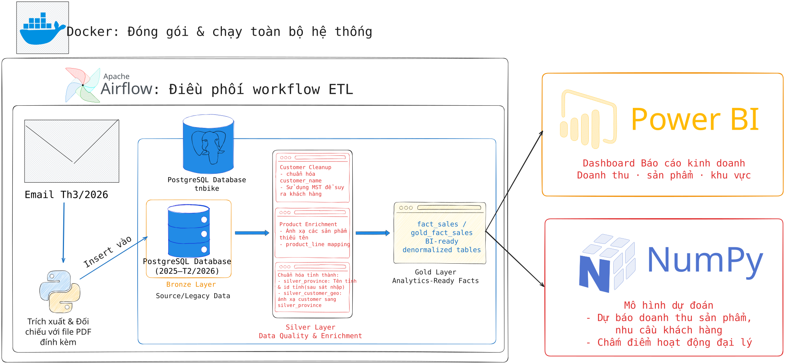

# DataExplorer — Email-to-Warehouse ETL Pipeline

Pipeline xử lý đơn hàng tự động cho **Công ty xe đạp Thống Nhất** trong cuộc thi Data Explorers 2026. Hệ thống nhận email đặt hàng từ đại lý (`.eml` có đính kèm PDF), trích xuất dữ liệu đơn hàng, kiểm tra hợp lệ và nạp vào PostgreSQL theo schema được cung cấp.

Project áp dụng **Medallion Architecture** để tách rõ các lớp dữ liệu: lớp **Bronze/Source** lưu dữ liệu giao dịch theo schema gốc, lớp **Silver** thực hiện làm sạch và làm giàu dữ liệu khách hàng, sản phẩm, địa lý, và lớp **Gold** tổng hợp, tạo các bảng fact phục vụ phân tích. Thiết kế này giữ nguyên khả năng tương thích với yêu cầu ban tổ chức, đồng thời bổ sung các lớp dữ liệu sạch hơn cho báo cáo và BI.
## Mục tiêu

Tự động xử lý toàn bộ đơn hàng tháng 3/2026 từ email/PDF và ghi dữ liệu hợp lệ vào database.

Đầu ra chính:

- `email_log`: ghi nhận trạng thái xử lý từng email
- `sales_order`: đầu đơn hàng
- `order_line`: dòng hàng hóa
- `fact_sales`: bảng fact phẳng theo schema gốc
- `silver_province`, `silver_customer_geo`: lớp địa lý đã qua làm sạch và chuẩn hóa
- `gold_fact_sales`: bảng fact nâng cao dùng địa lý legacy + Silver song song

## Tech Stack

- Apache Airflow 2.8.1
- PostgreSQL 13 / Debezium PostgreSQL image
- Python 3.11
- Docker Compose
- `pdfplumber`
- `psycopg2-binary`

## Triển khaipipeline Pipeline

### Yêu cầu

- Docker
- Docker Compose

### Khởi động

```bash
docker compose up -d
```

Các service chính:

| Service | Mô tả |
|---|---|
| `postgres-airflow` | Metadata database cho Airflow |
| `postgres_dataexp` | PostgreSQL nghiệp vụ, schema `tnbike` |
| `airflow-webserver` | Giao diện web của Airflow |
| `airflow-scheduler` | Thực thi DAG, lên lịch cho pipeline |
| `airflow-init` | Chạy migration Airflow DB và tạo user |

### Tài khoản mặc định

| Dịch vụ | User | Password |
|---|---|---|
| Airflow Web UI | `airflow` | `airflow` |
| PostgreSQL nghiệp vụ | `admin` | `admin` |
| PostgreSQL Airflow | `airflow` | `airflow` |

### Reset toàn bộ database

Khi muốn chạy lại từ đầu và chạy lại toàn bộ init scripts:

```bash
docker compose down -v
docker compose up --build -d
```

Lưu ý: `down -v` sẽ xóa Docker volumes, bao gồm dữ liệu PostgreSQL hiện tại.

## Cách chạy pipeline

1. Nếu chạy lần đầu, giải nén tất cả file `.eml` vào:

```text
maildata/incoming/
```

   **Nếu khởi động lại pipeline thì chạy lệnh sau ở terminal:**

```bash
 mv maildata/processed/*.eml maildata/incoming/ && mv maildata/failed/*.eml maildata/incoming 
```

2. Mở Airflow UI:

```text
http://localhost:8085
```

3. Trigger DAG bằng cách click vào biểu tượng nút Play ở Actions:

```text
email_order_pipeline
```

Hoặc trigger bằng CLI:

```bash
docker exec -it dataexplorer-airflow-scheduler-1 airflow dags trigger email_order_pipeline
```

Sau khi xử lý, email sẽ được chuyển tới:

```text
maildata/processed/  # nếu email xử lý thành công
maildata/failed/     # nếu email xử lý thất bại
```

Log của quá trình trích xuất dữ liệu từ email sẽ được lưu vào bảng:

```text
tnbike.email_log
```

4. 


## Kiến trúc hệ thống


## Luồng DAG

**DAG ID:** `email_order_pipeline`  
**Kích hoạt:** thủ công  
**Song song:** tối đa 8 mapped tasks

| # | Task | Mô tả |
|---|---|---|
| 1 | `list_eml_files` | Quét thư mục `maildata/incoming/` để lấy danh sách email |
| 2 | `process_single_email` | Mapped task: mỗi email một task. Parse email/PDF, validate, load DB, ghi log, route file |
| 3 | `summarize_results` | Tổng hợp số lượng thành công/thất bại và phân loại lỗi |
| 4 | `run_silver_layer` | Chạy các bước làm sạch/làm giàu dữ liệu |
| 5 | `refresh_fact_sales` | Làm mới bảng `fact_sales` theo schema legacy |
| 6 | `refresh_gold_fact_sales` | Làm mới bảng `gold_fact_sales` dùng geography Silver |

## Per-email ETL

Mỗi email được xử lý như một đơn vị độc lập trong mapped task `process_single_email`.

```text
.eml
→ đọc metadata của email
→ trích xuất file PDF đính kèm
→ đọc header PDF và bảng dòng hàng
→ kiểm tra số lượng, đơn giá, thành tiền
→ đảm bảo mã sản phẩm tồn tại trong product master
→ phân giải hoặc tự tạo khách hàng theo MST
→ upsert vào sales_order
→ thay thế order_line của đơn hàng để hỗ trợ rerun idempotent
→ ghi trạng thái xử lý vào email_log
→ di chuyển email sang processed/ hoặc failed/
```

### `extract.py` - Trích xuất dữ liệu

- Decode MIME headers của email.
- Lấy nội dung text/plain từ body email.
- Lưu file PDF đính kèm vào thư mục tạm.
- Trích xuất các trường neo từ email:
  - `so_number`
  - `MST`
  - tên khách hàng
  - địa chỉ khách hàng
  - tổng tiền khai báo trong email
- Đọc bảng dòng hàng trong PDF bằng `pdfplumber`
- Dùng regex fallback khi không đọc được bảng PDF theo cấu trúc bảng.

### `validators.py` - Kiểm tra hợp lệ

- Kiểm tra các trường bắt buộc của từng dòng hàng.
- Kiểm tra công thức: `quantity × unit_price ≈ line_total`
- Đối chiếu tổng tiền trích xuất từ PDF với tổng tiền neo trong email.
- Kiểm tra product_code có tồn tại trong `tnbike.product`
- Tự tạo sản phẩm thiếu dưới dạng unresolved row khi cần: `UNRESOLVED PRODUCT {product_code}`

### `loaders.py` - Ghi dữ liệu vào database

- Upsert `sales_order`
- Xóa và ghi lại `order_line` của cùng đơn hàng để hỗ trợ rerun idempotent.
- Upsert `email_log`
- Phân giải khách hàng bằng MST.
- Tự tạo khách hàng mới khi MST hợp lệ nhưng chưa tồn tại trong tnbike.customer.

### `router.py` - Phân loại file sau xử lý

- Di chuyển email xử lý thành công vào: `processed/`.
- Di chuyển email xử lý thất bại vào `failed/`.
- Dọn dẹp các file PDF tạm sau khi xử lý.

## Xử lý lỗi

Các lỗi nghiệp vụ hoặc lỗi dữ liệu được xử lý ngay bên trong từng mapped task xử lý email. Thay vì làm fail toàn bộ DAG, task sẽ trả về một `status dict` và ghi trạng thái xử lý vào bảng `email_log`.

Các nhóm lỗi phổ biến:

| Nhóm lỗi | Nguyên nhân |
|---|---|
| `missing_customer` | Body email không chứa MST/mã số thuế hợp lệ để xác định khách hàng |
| `missing_product` | Không trích xuất được `product_code` từ PDF |
| `line_total_mismatch` | Thành tiền trích xuất không khớp với số lượng × đơn giá hoặc tổng tiền đơn hàng |
| `unknown` | Các lỗi nghiệp vụ/dữ liệu khác ngoài các nhóm trên |

Các lỗi hạ tầng hoặc lỗi code nghiêm trọng, ví dụ PostgreSQL không kết nối được, lỗi import module, lỗi SQL warehouse, vẫn được để Airflow fail bình thường để dễ phát hiện và xử lý.

---

## Lớp Silver

Lớp Silver được dùng để làm sạch, chuẩn hóa và làm giàu dữ liệu sau khi dữ liệu đã được nạp vào các bảng gốc.

### Chuẩn hóa tên khách hàng

Một số email có tên khách hàng bị giữ lại nhãn trường như `Tên :` hoặc `Đại lý :`. Silver layer chuẩn hóa các giá trị này trước khi dùng cho phân tích.

Ví dụ:

```text
Tên : CÔNG TY TNHH PHÚC AN
→ CÔNG TY TNHH PHÚC AN

Đại lý : CỬA HÀNG XE ĐẠP A
→ CỬA HÀNG XE ĐẠP A
```

## Project structure

```text
DataExplorer/
├── airflow/
│   └── dags/
│       └── email_pipeline_dag.py
├── docs/
│   └── images/
│       └── pipeline-architecture.svg
├── init-scripts/
│   ├── 01_create_tables.sql
│   ├── 02_import_data.sql
│   ├── 03_create_email_log.sql
│   ├── 04_create_silver_tables.sql
│   └── 05_create_gold_tables.sql
├── maildata/
│   ├── incoming/
│   ├── processed/
│   └── failed/
├── src/
│   ├── __init__.py
│   ├── extract.py
│   ├── validators.py
│   ├── loaders.py
│   ├── router.py
│   ├── silver.py
│   └── warehouse.py
├── docker-compose.yml
├── dockerfile.airflow
├── requirements.txt
├── tnbike_database_schema.md
└── README.md
```

## Kiểm tra thủ công
Sau khi chạy DAG, có thể dùng các truy vấn dưới đây để kiểm tra nhanh trạng thái pipeline và chất lượng dữ liệu sau xử lý.

### Trạng thái xử lý email

```sql
SELECT processing_status, COUNT(*)
FROM tnbike.email_log
GROUP BY processing_status
ORDER BY processing_status;
```

### Số đơn hàng tháng 3/2026

```sql
SELECT COUNT(*) AS march_order_count
FROM tnbike.sales_order
WHERE order_date >= DATE '2026-03-01'
  AND order_date < DATE '2026-04-01';
```

### Số dòng hàng tháng 3/2026

```sql
SELECT COUNT(*) AS march_order_line_count
FROM tnbike.order_line ol
JOIN tnbike.sales_order so
    ON ol.order_id = so.order_id
WHERE so.order_date >= DATE '2026-03-01'
  AND so.order_date < DATE '2026-04-01';
```

### Số dòng fact tháng 3/2026

```sql
SELECT COUNT(*) AS march_fact_rows
FROM tnbike.fact_sales
WHERE order_date >= DATE '2026-03-01'
  AND order_date < DATE '2026-04-01';
```

### Độ phủ địa lý của layer Silver

```sql
SELECT
    COUNT(*) AS total_customers,
    COUNT(scg.customer_code) AS mapped_customers,
    COUNT(*) - COUNT(scg.customer_code) AS unmatched_customers
FROM tnbike.customer c
LEFT JOIN tnbike.silver_customer_geo scg
    ON c.customer_code = scg.customer_code;
```

### Độ phủ phân cấp sản phẩm

```sql
SELECT
    COUNT(*) AS fact_rows_without_product_line,
    SUM(quantity) AS quantity,
    SUM(line_total) AS revenue
FROM tnbike.fact_sales
WHERE line_id_fk IS NULL;
```

### Các sản phẩm thiếu product line còn lại

```sql
SELECT
    product_code,
    product_name,
    COUNT(*) AS fact_rows,
    SUM(quantity) AS total_qty,
    SUM(line_total) AS total_revenue
FROM tnbike.fact_sales
WHERE line_id_fk IS NULL
GROUP BY product_code, product_name
ORDER BY total_revenue DESC
LIMIT 30;
```

## Kiểm tra thủ công lớp Silver

Chạy lệnh sau bên trong container Airflow scheduler:

```bash
docker exec -it dataexplorer-airflow-scheduler-1 bash
cd /opt/airflow
PYTHONPATH=/opt/airflow/src python -c "from silver import run_silver_layer; run_silver_layer()"
```

Kết quả hiện tại kỳ vọng:

```text
unresolved_product_count = 0
silver_province_count = 34
mapped_customer_count = 797
unmatched_customer_count = 1
```

## Ghi chú phát triển

### Tạo lại Airflow user

Nếu tài khoản Airflow chưa được tạo tự động, có thể tạo thủ công bằng lệnh:

```bash
docker exec -it dataexplorer-airflow-scheduler-1 airflow users create \
  --username airflow \
  --password airflow \
  --firstname admin \
  --lastname admin \
  --role Admin \
  --email admin@example.com
```

Kiểm tra danh sách user:

```bash
docker exec -it dataexplorer-airflow-scheduler-1 airflow users list
```

### Moving processed emails back for reruns

Nếu email đã được chuyển sang processed/ và cần chạy lại DAG từ đầu:

```bash
docker exec -it dataexplorer-airflow-scheduler-1 bash
mv /opt/airflow/maildata/processed/*.eml /opt/airflow/maildata/incoming/
```

## Ghi chú Git

Không commit dữ liệu thô, file sinh ra trong runtime hoặc file cấu hình nhạy cảm:

```text
.env
CSVData/
EDA/output/
maildata/incoming/*
maildata/processed/*
maildata/failed/*
pdfdata/
processing/
*.rar
*.pdf
*.log
```

Các thành phần nên được commit:

```text
src/
airflow/dags/
init-scripts/
docker-compose.yml
dockerfile.airflow
requirements.txt
README.md
tnbike_database_schema.md
```

## Trạng thái hiện tại

Current status:

```text
Bronze ingestion: functional
Silver enrichment: functional and validated
fact_sales refresh: functional
gold_fact_sales: analytics-ready layer using Silver geography
```

Các giới hạn chất lượng dữ liệu còn lại:

```text
- 1 khách hàng chưa thể ánh xạ địa lý vì cả address và legacy province đều NULL.
- Một số sản phẩm vẫn chưa có product_line vì dòng catalogue tương ứng không tồn tại trong bảng product_line được cung cấp.
- Bảng province gốc được giữ lại như legacy/source geography, nhưng không được xem là nguồn địa lý chuẩn cho phân tích sạch.
```
